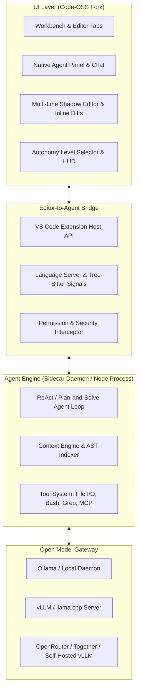
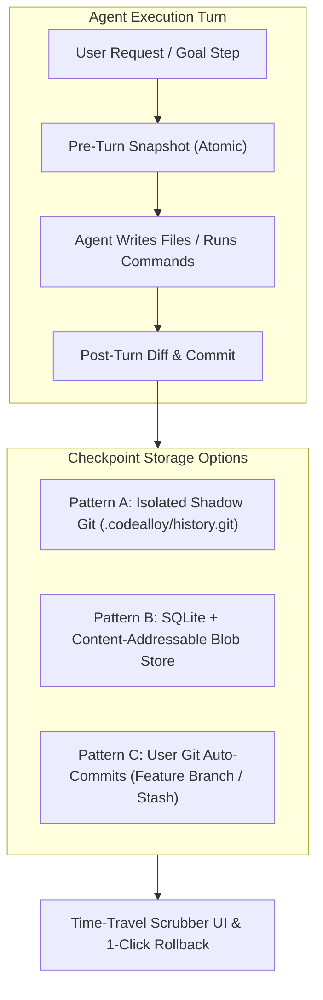

# CodeAlloy: Architecture & Execution Plan

> **"Where developer intent meets open models."**

A complete architectural blueprint and roadmap to build an open-source, open-model-native autonomous IDE forked from **Code-OSS / VSCodium**, delivering Antigravity/Cursor-grade capabilities with models like **Qwen 2.5 Coder**, **DeepSeek**, **Gemma**, and **Llama**.

---

## 1. Project Identity: CodeAlloy

* **Name**: **CodeAlloy**
* **Tagline**: *"Where developer intent meets open models."*
* **The Metaphor**: In metallurgy, an alloy combines elements to forge something far stronger and more resilient than any raw metal alone. **CodeAlloy** represents the fusion of three core pillars:
  1. **Developer Intent & Craft**: Controlled through configurable levels of autonomy, strict permissions, and atomic Shadow Git time-travel.
  2. **Open-Weights Sovereignty**: Native Ollama library integration, dynamic model discovery, zero closed-cloud lock-in, and full local privacy.
  3. **Battle-Tested Foundations**: Built on the rock-solid Code-OSS base with full Open VSX extension marketplace support.

---

## 2. Core Architectural Strategy: Fork vs. Extension vs. Hybrid

Creating a tool like Antigravity, Cursor, or Windsurf requires deep editor integration that conventional VS Code extensions cannot fully achieve.



### Why Fork Code-OSS (The VSCodium Route)?
- **Native Inline Diffs**: VS Code extensions cannot natively draw green/red inline diff streams inside the primary editor buffer without awkward virtual decorations. A fork allows custom editor widgets with instantaneous Accept/Reject keyboard triggers (`Tab` / `Esc`).
- **First-Class Agent Panels**: Render agent planning canvases, markdown artifacts, and browser previews directly in native side panels without webview sandbox throttling.
- **Terminal & File Interception**: Allows the IDE to inspect terminal output in real time and hook into file changes before they trigger standard watcher noise.

### Avoiding the "Fork Maintenance Nightmare"
Maintaining a direct fork of VS Code is notorious for painful upstream merges (as seen with deprecated attempts like Void). The recommended pattern is:
1. Maintain **Code-OSS** as the base with minimal surgical patches to workbench and editor internals.
2. Encapsulate all agent logic in an **Integrated Core Extension & Sidecar Process** rather than scattering agent logic across Microsoft's TypeScript source files.
3. Upstream updates to VS Code core can be rebased cleanly with minimal conflict.

---

## 3. Extension Marketplace & Ecosystem Compatibility

To ensure developers can install all their favorite tools:

1. **Default Marketplace: Open VSX (`open-vsx.org`)**
   - Configure `product.json` to point `extensionsGallery` to the Eclipse Open VSX registry (the legal, open-source alternative to Microsoft's Marketplace).
2. **Direct `.vsix` Drag-and-Drop / CLI Sideloading**
   - Provide standard `code --install-extension <pkg>.vsix` and GUI sideloading capabilities.
3. **Custom Extension Registry Mirroring**
   - Allow enterprise or self-hosted teams to point to an internal extension gallery (e.g., Verdaccio or internal Open VSX instance).
4. **Full API Shimming**
   - Keep the VS Code Extension Host 100% compliant so Python, Rust Analyzer, Go, Prettier, ESLint, GitLens, and themes work out of the box.

---

## 4. Levels of Autonomy

The user interface features a prominent **Autonomy Dial** (in the status bar or agent header) allowing instant switching:

```
[ L0: Assist ]  ->  [ L1: Chat ]  ->  [ L2: Supervised ]  ->  [ L3: Guarded ]  ->  [ L4: Autonomous ]
```

| Level | Name | How It Operates | Permission Gate | Best Used For |
| :--- | :--- | :--- | :--- | :--- |
| **Level 0** | **Assisted (Copilot)** | Real-time ghost text, inline completion, and snippet suggestions while typing. | No tool execution. Passive. | Quick syntax completion, boilerplates. |
| **Level 1** | **Interactive (Chat)** | Side-by-side chat. Analyzes open files, explains code, outputs diffs to chat window. | Manual copy/apply. No automated file edits. | Exploring new repos, rubber-ducking, architectural brainstorming. |
| **Level 2** | **Supervised (Pair)** | Agent formulates plans, suggests exact multi-file edits, and drafts shell commands. | **Strict Approval**: Every file write, file deletion, or terminal execution requires explicit 1-click user approval. | Risky refactoring, production codebases, unfamiliar scripts. |
| **Level 3** | **Guarded Autonomy** | Agent autonomously reads files, runs searches, and applies file modifications within workspace root. | **Selective Interception**: Destructive commands (`rm`, `git reset`), network calls, or operations outside workspace root pause for confirmation. | Feature development, writing tests, bug fixing within a project. |
| **Level 4** | **Full Autonomous (Goal Runner)** | Agent plans, creates artifacts, edits files, executes tests, reads stack traces, iterates, and self-heals until the goal passes. | **Zero-Confirmation Loop** with configurable limits (max iterations, token budget, loop circuit breakers, git commit rollback points). | Greenfield app scaffolding, comprehensive test suite generation, bulk migrations. |

### Safety Rails & Guardrails
- **Git Checkpoint Rollback**: Before any Level 3 or 4 action sequence, the engine automatically creates a lightweight Git checkpoint (`undo-last-agent-turn`).
- **Path Confinement**: Strict sandbox prevents reading/writing outside the opened workspace directory unless explicitly whitelisted.
- **Dangerous Command Interceptor**: Regex and heuristic blacklist for terminal actions (e.g., `sudo`, `mkfs`, raw credential exports, `curl | sh`).

---

## 5. Transactional History & Rollback Engine (Beyond Standard Git)

A fatal flaw of existing AI IDEs is that an agent running on high autonomy can modify or corrupt multiple files without an easy, one-click atomic undo. If the project isn't a Git repo—or if the developer doesn't want their clean `git status` polluted with dozens of agent micro-edits—the IDE must provide its own **bulletproof time-travel snapshot mechanism**.



### The Three Architectural Options

#### Pattern A: Isolated Shadow Git (`.codealloy/history.git`) — *(Recommended)*
Instead of polluting the user's working `.git` repository, the IDE automatically maintains an isolated, headless Git database inside `.codealloy/history.git` (or globally in `~/.codealloy/projects/<project_hash>/history.git` if users want zero hidden folders in their repo):
* **Works on Any Folder**: Works identically whether the user has run `git init` or opened a random folder of scripts.
* **Leverages Git Internals**: Git is already the fastest, most reliable, content-addressable delta store in the world. Using `git hash-object`, `git write-tree`, and `git commit-tree` takes sub-5ms per snapshot.
* **Zero Pollution**: Never touches the user's active branch, working tree staging index, or remote push history.
* **Complete State Snapshots**: Records directory state before and after every agent turn.

#### Pattern B: Pure Non-Git Local Timeline Engine (SQLite + Zstandard Blobs)
A native database-driven snapshot engine similar to IntelliJ's "Local History" or VS Code's file timeline, but multi-file and transactional.

#### Pattern C: User-Repo Auto-Git Mode (Opt-in)
If the project is a Git repository, the user can toggle an option for the agent to work on an isolated branch (`agent/<feature-name>`) and squash-merge clean commits on user approval.

---

## 6. Dynamic Model Engine & Ollama Ecosystem Integration

Models evolve at blistering speed. Hardcoding a fixed list of models into the IDE is an anti-pattern. The IDE treats models as dynamic, discoverable resources that users can search, pull, and switch between at any time.

```mermaid
graph LR
    subgraph UI_Triggers ["UI & Command Triggers"]
        Welcome["Initial Welcome / Onboarding Wizard"]
        CmdPal["Cmd+Shift+P: Pull Model / Switch Model"]
        HUD["Agent Status Bar / Model Dropdown"]
    end

    subgraph Discovery ["Dynamic Model Discovery"]
        OllamaDetect["Auto-detect Local Ollama Daemon (localhost:11434)"]
        OllamaTags["Query /api/tags (Installed Models)"]
        HardwareSpec["Hardware Prober (RAM, VRAM, Metal/CUDA)"]
    end

    subgraph Actions ["Model Operations"]
        Pull["Stream `ollama pull <model>` with UI Progress"]
        vLLM["Connect Custom vLLM / OpenAI / LM Studio URL"]
        Fallback["Dynamic Precedence Fallback Engine"]
    end

    UI_Triggers --> Discovery
    Discovery --> Actions
```



### 1. Dynamic Model Discovery & Resilient Fallbacks
- **No Hardcoded Versions**: The IDE queries the local runtime (`GET http://localhost:11434/api/tags`) to discover all locally installed models dynamically on startup.
- **Hardware-Aware Recommendations**: When the user asks for guidance, the IDE probes system memory (e.g., Apple Silicon unified memory or NVIDIA VRAM) and tags models accordingly:
  - *< 16 GB RAM*: Suggests 7B–9B quantizations (`qwen2.5-coder:7b`, `gemma2:9b`).
  - *16–32 GB RAM*: Suggests 14B models (`qwen2.5-coder:14b`, `deepseek-r1:14b`).
  - *32–64+ GB RAM*: Unlocks 32B–70B models (`qwen2.5-coder:32b`, `llama3.3:70b`).
- **Dynamic Fallback Chain**: If a designated model runs out of memory (OOM) or is unavailable, the engine falls back to an available backup model rather than crashing the agent turn.

### 2. Command Palette (`Cmd+Shift+P` / `Ctrl+Shift+P`) Integration
Users can manage and pull models without leaving their keyboard flow:
- `CodeAlloy: Pull / Download Ollama Model`: Prompts for model name/tag or lets user select from trending coding models. Streams real-time download layers and progress percentage directly in the IDE status bar / notification toast.
- `CodeAlloy: Select Active Model`: Quick-pick dropdown populated dynamically with all installed models + custom remote endpoints.
- `CodeAlloy: Add Custom OpenAI/vLLM/OpenRouter Endpoint`: Input custom base URL, model ID, and optional API key for self-hosted GPU rigs or cloud gateways.

### 3. Initial Startup & Onboarding Welcome Screen
When a user launches the IDE for the first time:
- **Environment Doctor**: Checks whether Ollama is already installed and running; provides 1-click installer guidance if missing.
- **Model Quick-Start**: One-click button to download recommended starter model (`Qwen 2.5 Coder 7B or 14B`), plus a direct search bar to pull any model tag from the Ollama library.
- **Self-Hosted Connect**: Option for users who already run a remote vLLM or OpenRouter gateway.

---

## 7. Context Engine & Tool System

1. **Context Engine**:
   - **AST Parsing (Tree-Sitter)**: Generates lightweight symbol graphs (classes, methods, imports) without needing heavy language servers.
   - **Local Vector Indexing**: Optional vector embeddings using small local models (`nomic-embed-text` or `bge-small` via SQLite/DuckDB-VSS).
   - **Smart Compaction**: Truncates large file views and prioritizes active editor tabs, diagnostics errors, and recent diffs.
2. **Built-in Tools**:
   - `view_file`, `write_to_file`, `replace_file_content`, `multi_replace_file_content`
   - `grep_search` (embedded `ripgrep` binary)
   - `list_dir`
   - `run_command` (PTY terminal session runner)
   - **Model Context Protocol (MCP)**: Native client support to connect to any standard MCP server (PostgreSQL, Git, GitHub, Browser, etc.).

---

## 8. Cross-Platform Native Packaging & Installers

| OS | Architectures | Target Formats | Tooling & Pipeline |
| :--- | :--- | :--- | :--- |
| **macOS** | Apple Silicon (`arm64`), Intel (`x64`), Universal | `.dmg`, `.zip` | Codesigned via Apple Developer ID, notarized and stapled via `notarytool`. |
| **Windows** | 64-bit (`x64`), ARM64 | `.exe` (Inno Setup / NSIS), Portable `.zip` | Custom branding icon, EV code signed, clean uninstaller, right-click "Open with CodeAlloy" context menu. |
| **Linux** | x64, ARM64 | `.deb`, `.rpm`, `.AppImage`, `.tar.gz` | Debian/Ubuntu package repositories, Snap/Flatpak compatibility, desktop menu `.desktop` integration. |

---

## 9. Phased Implementation Roadmap

```
[Phase 1: Agent & Rollback Engine] ──> [Phase 2: VSCodium Shell & UI] ──> [Phase 3: Native Installers & CI]
```

### Phase 1: The Engine Core & Shadow Git (Weeks 1–4)
- TypeScript/Node agent engine with dual-mode tool parsing (JSON schemas + XML fallback).
- Dynamic Ollama client with streaming pull and tag discovery.
- Shadow Git checkpoint manager (`.codealloy/history.git`) with sub-5ms snapshots and atomic rollback.
- Autonomy state machine (Levels 0 through 4).

### Phase 2: VSCodium Custom Shell & Dynamic UI (Weeks 5–8)
- Clone and patch `VSCodium` / `Code-OSS` branding (`product.json`).
- Configure **Open VSX** as default extension marketplace.
- Implement the Onboarding Welcome Screen and Command Palette model puller.
- Native Agent Sidebar (Chat, Plan Artifacts, Autonomy dial, Checkpoint Scrubber).
- Inline streaming diff renderer with `Tab` / `Esc` chunk controls.

### Phase 3: Cross-Platform Packaging & Distribution (Weeks 9–12)
- Set up GitHub Actions matrix build pipeline for macOS (`.dmg`), Windows (`.exe`), and Linux (`.deb`, `.AppImage`).
- Code signing and notarization automation.
- Auto-updater service integration using standard Electron/VS Code squirrel or custom update manifests.
